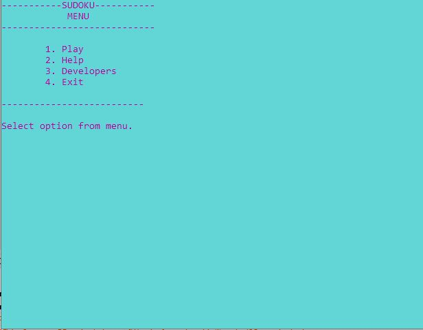
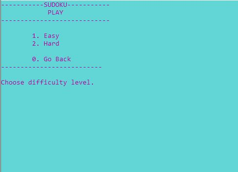
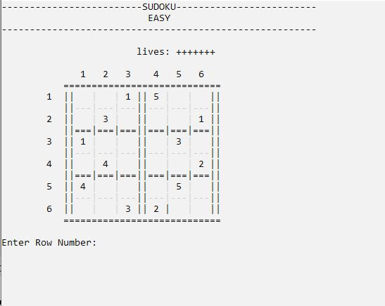
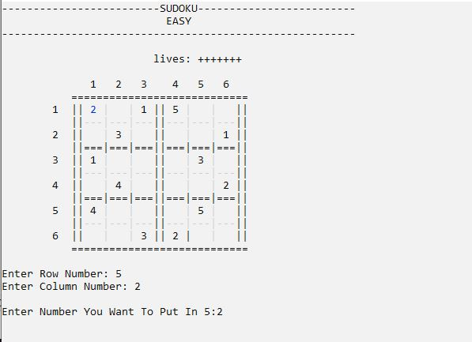

# 🎯 Sudoku Game (C++ Console-Based)  

This is a **C++ console-based Sudoku game** with **Easy** and **Hard** difficulty levels. It provides an interactive CLI experience with color formatting for better visibility.  

## 🚀 Features  
✔️ **Two Difficulty Levels** – Easy & Hard  
✔️ **Standalone Execution** – Runs via `Sudoku.exe` (No compiler needed)  
✔️ **Color-Formatted Output** for better readability  
✔️ **Interactive Gameplay** with real-time user input validation  

## 🛠 Project Structure  
📌 **Sudoku.cpp** – Main game file  
📌 **play.hpp & haseeb.hpp** – User-defined header files  
📌 **Colors_test.cpp** – Integrated color formatting (sourced from the internet)  

## 🎮 How to Play  
1️⃣ Run `Sudoku.exe` directly.  
2️⃣ Choose **Easy** or **Hard** difficulty.  
3️⃣ Solve the Sudoku puzzle by entering valid numbers.  
4️⃣ Enjoy the challenge and improve your Sudoku skills!  

## 📸 Screenshots  
### Main Menu  
  

### Difficulty Selection  
  

### Playing Easy Mode  
  

### Entering Values  
  

## 📥 Installation & Execution  
1. Clone this repository:  
   ```sh
   git clone https://github.com/haseebsiddique89/Sudoku.git
